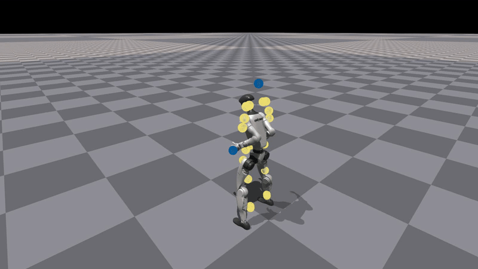

<h1 align="center"> ASAP: Aligning Simulation and Real-World Physics for 

Learning Agile Humanoid Whole-Body Skills </h1>

<div align="center">

[[Website]](https://agile.human2humanoid.com/)
[[Arxiv]](https://arxiv.org/pdf/2502.01143)
[[Video]](https://www.youtube.com/watch?v=tu7LSNYWDTs&ab_channel=LeCARLabatCMU)

<p align="center">
     &nbsp; &nbsp; &nbsp; &nbsp; &nbsp; &nbsp; &nbsp; &nbsp; &nbsp; &nbsp;
</p>


[](https://developer.nvidia.com/isaac-gym) [](https://docs.isaacsim.omniverse.nvidia.com/4.2.0/index.html) [](https://docs.isaacsim.omniverse.nvidia.com/4.2.0/index.html) [](https://ubuntu.com/blog/tag/22-04-lts) []()


</div>

## TODO
- [x] Release code backbone
- [x] Release phase-based motion tracking training pipeline
- [ ] Release ASAP motion datasets
- [ ] Release motion retargeting pipeline
- [ ] Release sim2sim in MuJoCo
- [ ] Release sim2real with UnitreeSDK
- [ ] Release ASAP delta action model training pipeline


# Installation

ASAP codebase is built on top of [HumanoidVerse](https://github.com/LeCAR-Lab/HumanoidVerse) (a multi-simulator framework for humanoid learning) and [Human2Humanoid](https://github.com/LeCAR-Lab/human2humanoid) (our prior work on humanoid whole-body tracking).

[HumanoidVerse](https://github.com/LeCAR-Lab/HumanoidVerse) allows you to train humanoid skills in multiple simulators, including IsaacGym, IsaacSim, and Genesis. Its key design logic is the separation and modularization of simulators, tasks, and algorithms, which enables smooth transfers between different simulators and the real world with minimum effort (just one line of code change). We leverage this framework to develop [ASAP](https://agile.human2humanoid.com/) and study how to best transfer policies across simulators and the real world.

## IsaacGym Conda Env

Create mamba/conda environment, in the following we use conda for example, but you can use mamba as well.

```bash
conda create -n hvgym python=3.8
conda activate hvgym
```
### Install IsaacGym

Download [IsaacGym](https://developer.nvidia.com/isaac-gym/download) and extract:

```bash
wget https://developer.nvidia.com/isaac-gym-preview-4
tar -xvzf isaac-gym-preview-4
```

Install IsaacGym Python API:

```bash
pip install -e isaacgym/python
```

Test installation:

```bash
python 1080_balls_of_solitude.py  # or
python joint_monkey.py
```

For libpython error:

- Check conda path:
    ```bash
    conda info -e
    ```
- Set LD_LIBRARY_PATH:
    ```bash
    export LD_LIBRARY_PATH=</path/to/conda/envs/your_env/lib>:$LD_LIBRARY_PATH
    ```

### Install HumanoidVerse

Install dependencies:
```bash
pip install -e .
pip install -e isaac_utils
```

Test with:
```bash
HYDRA_FULL_ERROR=1 python humanoidverse/train_agent.py \
+simulator=isaacgym \
+exp=locomotion \
+domain_rand=NO_domain_rand \
+rewards=loco/reward_g1_locomotion \
+robot=g1/g1_29dof_anneal_23dof \
+terrain=terrain_locomotion_plane \
+obs=loco/leggedloco_obs_singlestep_withlinvel \
num_envs=1 \
project_name=TestIsaacGymInstallation \
experiment_name=G123dof_loco \
headless=False
```
<details>
<summary>Note:</summary>
This is ONLY for testing, NOT how we train the locomotion policy in the ASAP paper. But still, you can train a locomotion policy by:

```bash
HYDRA_FULL_ERROR=1 python humanoidverse/train_agent.py \
+simulator=isaacgym \
+exp=locomotion \
+domain_rand=NO_domain_rand \
+rewards=loco/reward_g1_locomotion \
+robot=g1/g1_29dof_anneal_23dof \
+terrain=terrain_locomotion_plane \
+obs=loco/leggedloco_obs_singlestep_withlinvel \
num_envs=4096 \
project_name=TestIsaacGymInstallation \
experiment_name=G123dof_loco \
headless=True \
rewards.reward_penalty_curriculum=True \
rewards.reward_initial_penalty_scale=0.1 \
rewards.reward_penalty_degree=0.00003 
```

</details>

## IsaacLab Environment

### Install IsaacSim
1. Download Omniverse Launcher
2. Install Isaac Sim through launcher
3. Set environment variables:
```bash
export ISAACSIM_PATH="${HOME}/.local/share/ov/pkg/isaac-sim-4.2.0"
export ISAACSIM_PYTHON_EXE="${ISAACSIM_PATH}/python.sh"
```

### Install IsaacLab
```bash
git clone https://github.com/isaac-sim/IsaacLab.git
cd IsaacLab && ./isaaclab.sh --conda hvlab
mamba activate hvlab
sudo apt install cmake build-essential
./isaaclab.sh --install
```

### Setup HumanoidVerse
```bash
pip install -e .
pip install -e isaac_utils
```

## Genesis Environment
```bash
mamba create -n hvgen python=3.10
mamba activate hvgen
pip install genesis-world torch
```
Install dependencies:

```bash
pip install -e .
pip install -e isaac_utils
```


# Motion Tracking Training

Train a phase-based motion tracking policy to imitate Cristiano Ronaldo's signature Siuuu move

```bash
python humanoidverse/train_agent.py \
+simulator=isaacgym \
+exp=motion_tracking \
+domain_rand=NO_domain_rand \
+rewards=motion_tracking/reward_motion_tracking_dm_2real \
+robot=g1/g1_29dof_anneal_23dof \
+terrain=terrain_locomotion_plane \
+obs=motion_tracking/deepmimic_a2c_nolinvel_LARGEnoise_history \
num_envs=4096 \
project_name=MotionTracking \
experiment_name=MotionTracking_CR7 \
robot.motion.motion_file="humanoidverse/data/motions/g1_29dof_anneal_23dof/TairanTestbed/singles/0-TairanTestbed_TairanTestbed_CR7_video_CR7_level1_filter_amass.pkl" \
rewards.reward_penalty_curriculum=True \
rewards.reward_penalty_degree=0.00001 \
env.config.resample_motion_when_training=False \
env.config.termination.terminate_when_motion_far=True \
env.config.termination_curriculum.terminate_when_motion_far_curriculum=True \
env.config.termination_curriculum.terminate_when_motion_far_threshold_min=0.3 \
env.config.termination_curriculum.terminate_when_motion_far_curriculum_degree=0.000025 \
robot.asset.self_collisions=0
```

After training, you can visualize the policy by:
```bash
python humanoidverse/eval_agent.py \
+logs=logs/MotionTracking/xxxxxxxx_xxxxxxx-MotionTracking_CR7-motion_tracking-g1_29dof_anneal_23dof/model_5800.pt
```

This is the visualization of the policy after traning 5800 iters. The policy is able to imitate the motion of Cristiano Ronaldo's Siuuu move. With more training, the policy will be more accurate and smooth (see the video in the [paper](https://arxiv.org/pdf/2502.01143)).



# Citation
If you find our work useful, please consider citing us!

```bibtex
@article{he2025asap,
  title={ASAP: Aligning Simulation and Real-World Physics for Learning Agile Humanoid Whole-Body Skills},
  author={He, Tairan and Gao, Jiawei and Xiao, Wenli and Zhang, Yuanhang and Wang, Zi and Wang, Jiashun and Luo, Zhengyi and He, Guanqi and Sobanbabu, Nikhil and Pan, Chaoyi and Yi, Zeji and Qu, Guannan and Kitani, Kris and Hodgins, Jessica and Fan, Linxi "Jim" and Zhu, Yuke and Liu, Changliu and Shi, Guanya},
  journal={arXiv preprint arXiv:2502.01143},
  year={2025}
}
```

# License

This project is licensed under the MIT License - see the [LICENSE](LICENSE) file for details.
